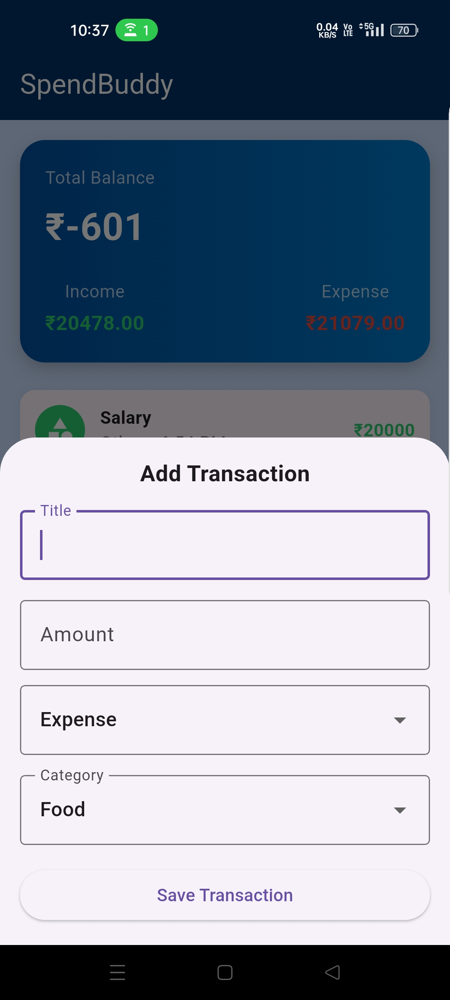
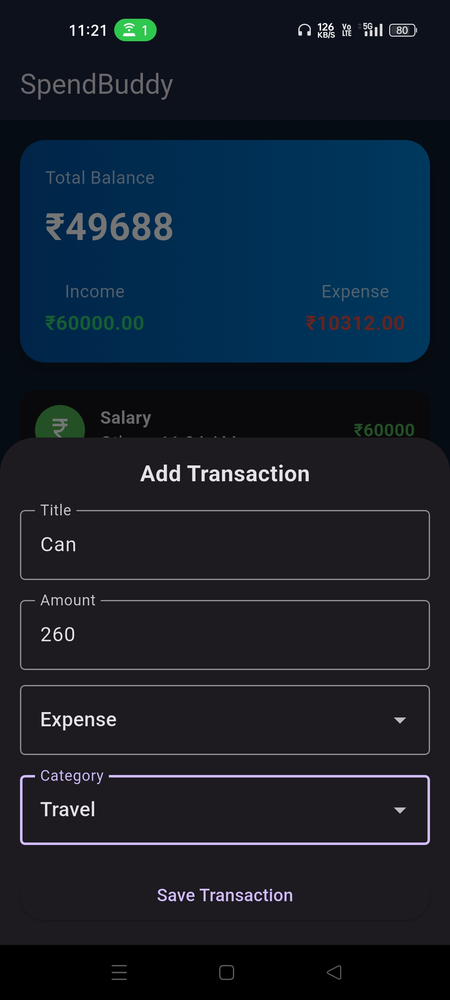
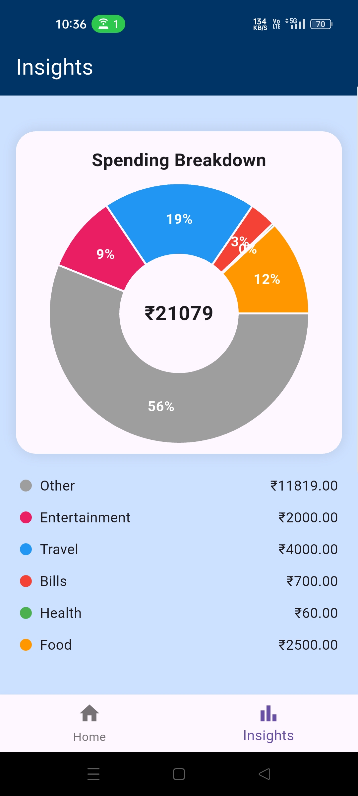
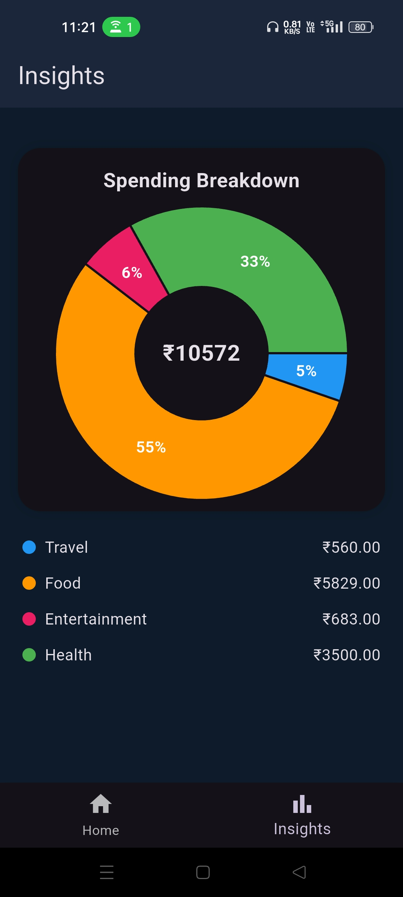
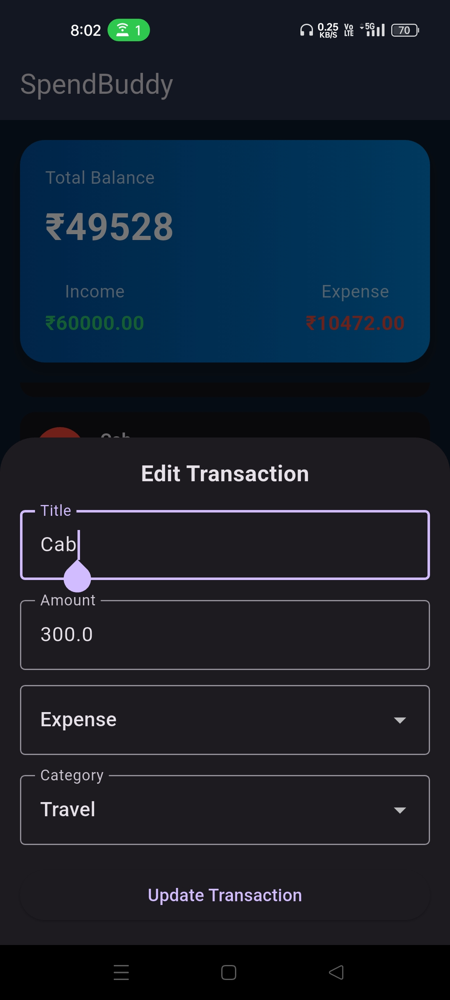

# 💸 SpendBuddy – Personal Finance Companion App

SpendBuddy is a clean and intuitive **personal finance tracking app** built with Flutter.
It helps users track daily expenses, understand spending habits, and gain insights through simple and meaningful visualizations.

---

## 🚀 Features

### 🏠 Dashboard

* View **total balance, income, and expenses**
* Clean and minimal UI for quick understanding

### 💰 Transaction Management

* Add income and expense transactions
* Edit existing transactions
* Delete transactions with swipe gesture
* Category-based organization (Food, Travel, Bills, etc.)

### 📊 Insights & Analytics

* Category-wise **pie chart visualization**
* Identify spending patterns easily
* Highlight top spending categories

### 🎨 UI/UX

* Modern card-based design
* Smooth interactions and navigation
* Dark mode support 🌙
* Responsive and mobile-friendly layout

---

## 🛠 Tech Stack

* **Flutter (Dart)** – Cross-platform UI framework
* **Hive** – Lightweight local database
* **fl_chart** – Data visualization (pie charts)
* **Material Design** – UI components

---

## 🧠 Key Highlights

* Clean and scalable project structure
* Separation of concerns (core, data, features)
* Reusable widgets and components
* Real-time UI updates after transactions
* Optimized performance with smooth scrolling

---

## 📱 App Screens

* Dashboard Screen
* Add / Edit Transaction Screen
* Transaction List
* Insights Screen

---

## 📂 Project Structure

```
lib/
│
├── core/
│   ├── constants/
│   ├── theme/
│   └── utils/
│
├── data/
│   └── repositories/
│
├── features/
│   ├── home/
│   ├── transactions/
│   └── insights/
│
├── widgets/
└── main.dart
```

---

## 📸 Screenshots









* Dashboard
* Add Transaction
* Insights Screen
* Dark Mode

---

## ▶️ Getting Started

### 1. Clone the repository

```bash
git clone https://github.com/divyaTyagi123/SpendBuddy.git
cd spendbuddy
```

### 2. Install dependencies

```bash
flutter pub get
```

### 3. Run the app

```bash
flutter run
```

---

## 💡 Assumptions & Decisions

* Local storage (Hive) is used for simplicity and offline support
* Categories are predefined for better user experience
* Focus was on **clarity, usability, and clean architecture** rather than overloading features

---

## 🎯 Future Improvements

* Budget tracking feature
* Search and filter transactions
* Export data (CSV/PDF)
* Notifications and reminders
* Multi-currency support

---

## 👨‍💻 Author

**Divya Tyagi**
B.Tech CSE (AIML) Student | Flutter Developer

---

## ⭐ If you like this project

Give it a ⭐ on GitHub and share your feedback!

